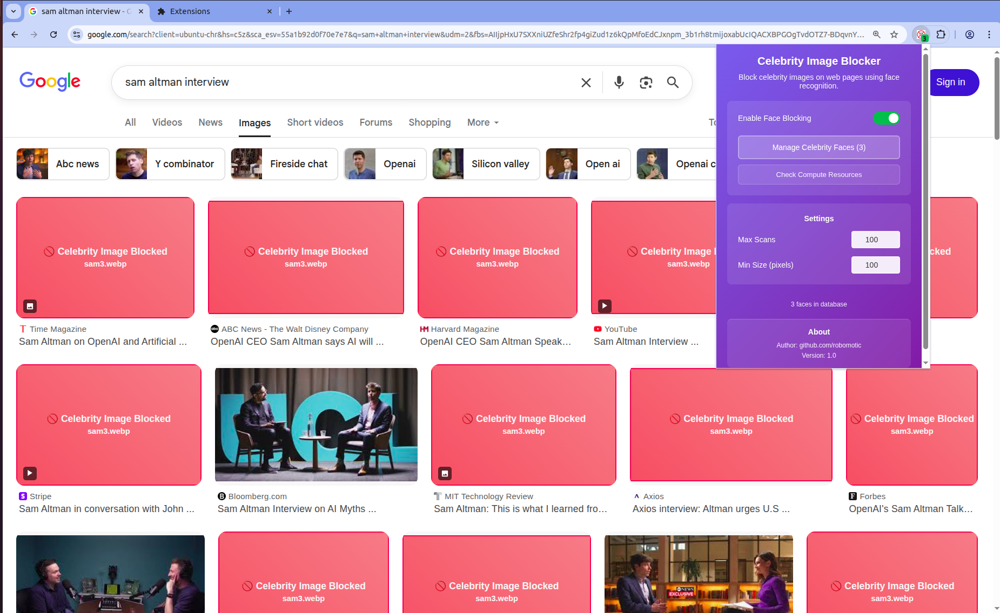

# Celebrity Image Blocker

## Overview
The Celebrity Image Blocker is a Chrome extension designed to enhance your browsing experience by blocking images of specific celebrities. Users can upload headshot images of celebrities, and the extension will utilize a face matching algorithm to identify and block those images on web pages.

## Features
- Upload headshot images of celebrities for face recognition
- Real-time image detection and blocking on web pages using AI face matching
- Configurable scanning limits (Max Scans) to optimize performance
- Adjustable minimum image size filtering to skip small icons and thumbnails
- System resource checking with automatic performance optimization
- User-friendly popup interface for managing settings and uploaded images
- Options page for configuring settings and uploading celebrity images
- Visual feedback with blocked image notifications
- Cross-origin image support with fallback mechanisms

## Installation
1. Clone the repository to your local machine.
2. Open Chrome and navigate to `chrome://extensions/`.
3. Enable "Developer mode" in the top right corner.
4. Click on "Load unpacked" and select the `celebrity-image-blocker` directory.

## Usage
1. **Installation**: Click on the extension icon to open the popup interface.
2. **Setup**: Navigate to the options page to upload headshot images of celebrities you want to block.
3. **Configuration**: Adjust settings in the popup:
   - **Max Scans**: Set how many images to check per page (default: 10)
   - **Min Size**: Set minimum image size to scan in pixels (default: 200x200)
   - **Check Compute**: Test your system's performance capabilities
4. **Browsing**: Browse any web page, and the extension will automatically detect and block images matching your uploaded celebrity faces.
5. **Monitoring**: Blocked images are replaced with notification blocks showing which celebrity was detected.

## Screenshots

*For more screenshots and visual examples, see the [screenshots folder](screenshots/).*

## Performance & System Requirements
- **Minimum RAM**: 2GB recommended for optimal performance
- **CPU**: Multi-core processor recommended (2+ cores)
- **Browser**: Chrome/Chromium-based browsers with WebGL support
- **Network**: Works offline after initial model loading

The extension includes an intelligent resource checker that automatically adjusts performance based on your system capabilities.

## Technical Details
- **Face Detection**: Uses TensorFlow.js and face-api.js for accurate face recognition
- **Model Architecture**: SSD MobileNet v1 for detection, 68-point facial landmarks, and face recognition neural networks
- **Model Loading**: Models are loaded on-demand from CDN to reduce extension size
- **Performance Optimization**: Configurable scanning limits and intelligent image filtering
- **Storage**: Uses Chrome's local storage API for celebrity image data
- **Cross-Origin Support**: Handles images from different domains with appropriate fallbacks
- **Real-time Processing**: Monitors page changes and processes new images dynamically
- **Extension Size**: Less than 1MB (models loaded from CDN when needed)

## Contributing
Contributions are welcome! Please feel free to submit a pull request or open an issue for any enhancements or bug fixes.

### Development Setup
1. Clone the repository
2. Make your changes to the source files
3. Test the extension by loading it unpacked in Chrome
4. Ensure all features work on different websites
5. Submit a pull request with a clear description of changes

### Known Issues
- Face detection requires good lighting and clear facial features
- Very small or low-resolution images may not be detected accurately
- Performance varies based on system specifications and page complexity

## Changelog
### v1.1 (Latest)
- ✅ **Reduced extension size by 90%** - Models now load from CDN on-demand
- ✅ **Improved permissions** - Removed `<all_urls>` permission for better privacy
- ✅ **Lazy loading** - Models only load when images are detected
- ✅ **Faster installation** - Extension installs instantly without large model files
- ✅ **Better performance** - On-demand loading reduces memory usage

### v1.0
- ✅ Added configurable Max Scans setting (1-100 images per page)
- ✅ Added configurable Min Size setting (50-1000 pixels)
- ✅ Added "Check Compute Resources" feature with auto-disable for low-performance systems
- ✅ Improved error handling and fallback mechanisms
- ✅ Enhanced UI with better status feedback
- ✅ Added WebGL support detection
- ✅ Optimized performance with intelligent image filtering

## Privacy Policy
This extension respects your privacy and processes all data locally on your device. For complete details about data handling and privacy practices, see our [Privacy Policy](PRIVACY_POLICY.md).

## License
This project is licensed under the MIT License. See the LICENSE file for more details.